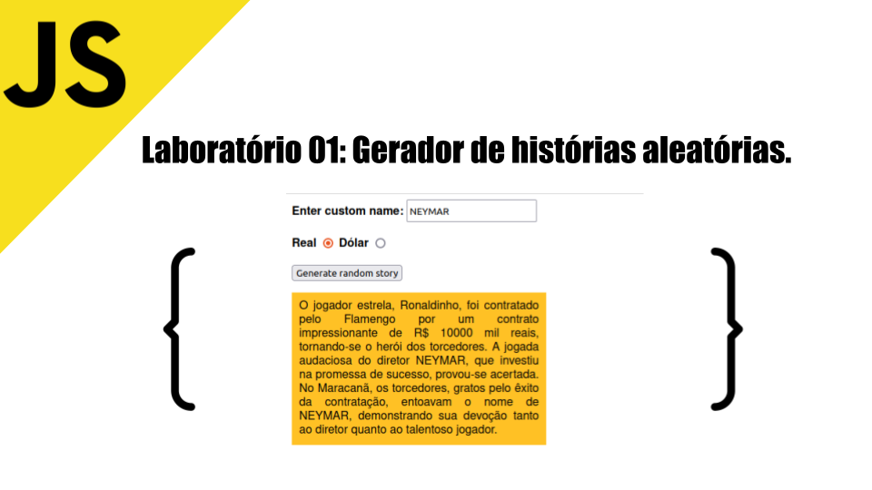

# Laboratório - 01 

>Professor: Moisés Gomes de Carvalho
>
>Aluno: Ícaro Santos Pereira

Repositório criado para desenvolver a atividade 01 da disciplina de javascript [WACAD003] da capacitação e desenvolvimento em Web Full Stack, [WebAcademy](https://webacademy.icomp.ufam.edu.br/).

- [Javascript](./js/main.js)
- [HTML](./index.html)
- [CSS](./css/style.css)
- [Link da apresentação](https://docs.google.com/presentation/d/1z9mMJHh-CGhi5sbS8TF5pQrO7zH9I8ktY-TLFqfsv8E/edit?usp=sharing)
- [Slide](./assets/slide/laboratorio_01_icaro.pdf)

